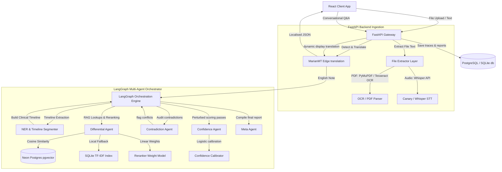

# System Architecture & Multi-Agent Design

This document details the system design, multi-agent layout, state routing, and AI models powering the **Clinical Reasoning Engine**.

---

## 1. System Architecture Diagram

The system follows a clean client-server architecture:



---

## 2. Core Architectural Layers

### 2.1. Client Layer (React / Vite)
- Core dashboard implemented in [App.jsx](file:///c:/Structured%20Clinical%20Reasoning%20Engine%20for%20Unstructured%20Discharge%20Notes/clinical-reasoning-engine/frontend/src/App.jsx).
- Integrates sub-dashboards:
  - [TimelineView.jsx](file:///c:/Structured%20Clinical%20Reasoning%20Engine%20for%20Unstructured%20Discharge%20Notes/clinical-reasoning-engine/frontend/src/components/TimelineView.jsx) for visual segmenting.
  - [ContradictionCards.jsx](file:///c:/Structured%20Clinical%20Reasoning%20Engine%20for%20Unstructured%20Discharge%20Notes/clinical-reasoning-engine/frontend/src/components/ContradictionCards.jsx) for safety alerts.
  - [ConfidenceBars.jsx](file:///c:/Structured%20Clinical%20Reasoning%20Engine%20for%20Unstructured%20Discharge%20Notes/clinical-reasoning-engine/frontend/src/components/ConfidenceBars.jsx) for ranked calibrated differentials.
- Interactive sidebars handle conversational Q&A and medical liability warnings.

### 2.2. Ingestion & File Processing Layer
- **Text File Extraction**: Processed directly via Python UTF-8 decoding.
- **PDF Extraction**: [file_extractor.py](file:///c:/Structured%20Clinical%20Reasoning%20Engine%20for%20Unstructured%20Discharge%20Notes/clinical-reasoning-engine/backend/ingestion/file_extractor.py) extracts native text. If a scanned document is detected (empty text output), pages are converted to PNG images via PyMuPDF and processed by local Tesseract OCR.
- **Audio Ingestion**: Transcribes WAV, MP3, and M4A audio dictation files using the serverless Whisper API.
- **Clinical NER**: Parses note structures. Implemented in [ner_extractor.py](file:///c:/Structured%20Clinical%20Reasoning%20Engine%20for%20Unstructured%20Discharge%20Notes/clinical-reasoning-engine/backend/ingestion/ner_extractor.py). Falls back to a deterministic regular-expression phrase-matcher when scispaCy is unavailable.

### 2.3. Multilingual Translation Layer
- Managed by Helsinki-NLP MarianMT transformer models at the API edge ([translation_layer.py](file:///c:/Structured%20Clinical%20Reasoning%20Engine%20for%20Unstructured%20Discharge%20Notes/clinical-reasoning-engine/backend/translation_layer.py)).
- Detects input note languages (`langdetect`) and translates them to English.
- The pipeline processes the clinical notes in English to preserve stable semantics.
- Translates structured fields in the final report back into the client's display language.

---

## 3. LangGraph Orchestration State

The agentic pipeline compiles into a State Graph defined in [graph.py](file:///c:/Structured%20Clinical%20Reasoning%20Engine%20for%20Unstructured%20Discharge%20Notes/clinical-reasoning-engine/backend/agents/graph.py).

### 3.1. LangGraph State Variables
The orchestration data frame carries the following typed attributes:
```python
class GraphState(TypedDict, total=False):
    note_id: str                          # Note identifier
    note_text: str                        # Raw English note
    timeline: ClinicalTimeline            # Admission -> Course -> Discharge events
    differentials: List[Hypothesis]       # Candidates
    contradictions: List[Contradiction]   # Inconsistencies detected
    confidence_scores: List[ConfidenceScore] # Calibrated scores
    reasoning_trace: List[AuditStep]      # Node action logs
    orchestration_trace: List[PolicyDecision] # Policy evaluations
    report: NoteReport                    # Compiled payload
```

---

## 4. Node Details & Agent Roles

### 4.1. NER & Timeline segmenter
Segments notes chronologically and maps clinical entities.
- Script: [timeline_builder.py](file:///c:/Structured%20Clinical%20Reasoning%20Engine%20for%20Unstructured%20Discharge%20Notes/clinical-reasoning-engine/backend/ingestion/timeline_builder.py).
- Resolves event statuses by looking for semantic qualifiers (e.g. "active", "resolved", "worsened").

### 4.2. Differential Agent
- Script: [differential.py](file:///c:/Structured%20Clinical%20Reasoning%20Engine%20for%20Unstructured%20Discharge%20Notes/clinical-reasoning-engine/backend/agents/differential.py).
- Matches timeline findings with database clinical guidelines using a RAG retriever.
- Utilizes the learned linear reranker to sort diagnoses based on features like section coverage and discharge support.

### 4.3. Contradiction Agent
- Script: [contradiction.py](file:///c:/Structured%20Clinical%20Reasoning%20Engine%20for%20Unstructured%20Discharge%20Notes/clinical-reasoning-engine/backend/agents/contradiction.py).
- Analyzes timelines for discrepancies across admission, hospital course, and discharge.
- Categorizes conflicts as `missing_symptom`, `new_finding`, or `status_reversal`.

### 4.4. Confidence Agent
- Script: [confidence.py](file:///c:/Structured%20Clinical%20Reasoning%20Engine%20for%20Unstructured%20Discharge%20Notes/clinical-reasoning-engine/backend/agents/confidence.py).
- Runs 8 perturbed passes to compute prediction variance (uncertainty estimation).
- Evaluates feature vectors using a logistic regression calibrator to output calibrated confidence probabilities.

### 4.5. Meta Agent
- Script: [meta.py](file:///c:/Structured%20Clinical%20Reasoning%20Engine%20for%20Unstructured%20Discharge%20Notes/clinical-reasoning-engine/backend/agents/meta.py).
- Combines timeline logs, contradiction warnings, and calibrated scores into the final JSON payload.

---

## 5. Decision Policies & Routing

The workflow uses middleman routing policy nodes in [nodes.py](file:///c:/Structured%20Clinical%20Reasoning%20Engine%20for%20Unstructured%20Discharge%20Notes/clinical-reasoning-engine/backend/orchestration/nodes.py):
1. **Post-Differential Decision**: Evaluates candidate counts and skips reranking if candidates are insufficient.
2. **Post-Contradiction Decision**: Logs a policy decision when low diagnosis scores overlap with high contradiction counts, indicating a need for secondary RAG queries.
