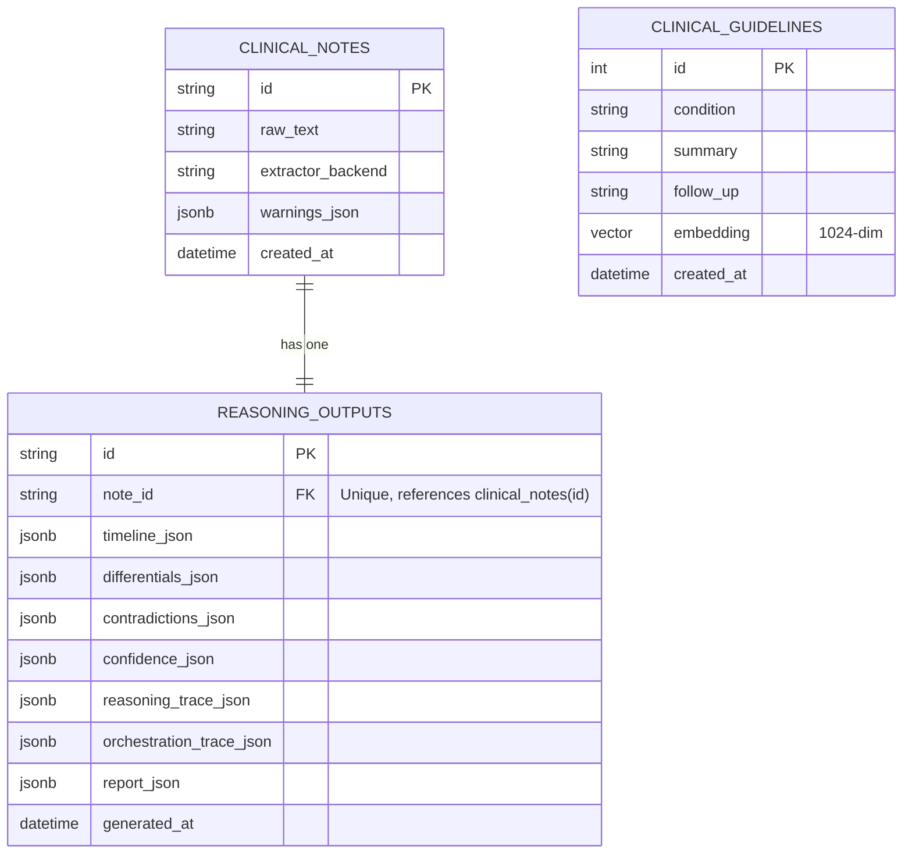

# Backend Schema Document
## Clinical Reasoning Engine

---

## 1. Database Storage Strategy
The Clinical Reasoning Engine database is designed with database-engine parity in mind:
- **Production Layer**: PostgreSQL (hosted on Neon Postgres) utilizing `JSONB` for optimized indexing and document-store flexibility.
- **Local Development Layer**: SQLite (configured at `backend/db/reports.sqlite3`) utilizing standard `JSON` column types.
- **ORM abstraction**: Standardized via SQLAlchemy in [models.py](file:///C:/Structured%20Clinical%20Reasoning%20Engine%20for%20Unstructured%20Discharge%20Notes/clinical-reasoning-engine/backend/db/models.py). The active connection string is resolved via the environment variable `DATABASE_URL`, falling back automatically to SQLite.

---

## 2. Entity-Relationship Diagram (ERD)

The database maps a one-to-one relationship between clinical notes (raw records) and reasoning outputs (reasoning engine reports), alongside a standalone guidelines table used for semantic RAG lookups.



---

## 3. Database Table Definitions

### 3.1. Table: `clinical_notes`
Stores the original ingested record metadata and raw text.
- Physical Definition: [schema.sql](file:///C:/Structured%20Clinical%20Reasoning%20Engine%20for%20Unstructured%20Discharge%20Notes/clinical-reasoning-engine/backend/db/schema.sql#L1-L7)
- SQLAlchemy Definition: [models.py](file:///C:/Structured%20Clinical%20Reasoning%20Engine%20for%20Unstructured%20Discharge%20Notes/clinical-reasoning-engine/backend/db/models.py#L9-L19)

| Column Name | SQL Data Type | Nullable | Default | Constraints | Description |
| :--- | :--- | :---: | :--- | :--- | :--- |
| `id` | `TEXT` / `VARCHAR(64)` | No | *None* | Primary Key | Unique identifier (e.g. UUIDv4 or custom ID) |
| `raw_text` | `TEXT` | No | *None* | *None* | Ingested clinical text summary |
| `extractor_backend` | `TEXT` / `VARCHAR(64)` | No | *None* | *None* | Backend parser used (`scispacy` or `rules`) |
| `warnings_json` | `JSONB` / `JSON` | No | `'[]'::jsonb` | *None* | Extraction and translation warnings logged |
| `created_at` | `TIMESTAMPTZ` | No | `NOW()` | *None* | Audit entry creation timestamp |

### 3.2. Table: `reasoning_outputs`
Stores the output reports and traces generated by the multi-agent LangGraph.
- Physical Definition: [schema.sql](file:///C:/Structured%20Clinical%20Reasoning%20Engine%20for%20Unstructured%20Discharge%20Notes/clinical-reasoning-engine/backend/db/schema.sql#L9-L20)
- SQLAlchemy Definition: [models.py](file:///C:/Structured%20Clinical%20Reasoning%20Engine%20for%20Unstructured%20Discharge%20Notes/clinical-reasoning-engine/backend/db/models.py#L21-L36)

| Column Name | SQL Data Type | Nullable | Default | Constraints | Description |
| :--- | :--- | :---: | :--- | :--- | :--- |
| `id` | `TEXT` / `VARCHAR(64)` | No | *None* | Primary Key | Output identifier (matches `note_id`) |
| `note_id` | `TEXT` / `VARCHAR(64)` | No | *None* | Foreign Key, Unique | References `clinical_notes(id)` on cascade delete |
| `timeline_json` | `JSONB` / `JSON` | No | *None* | *None* | Structured clinical timeline events |
| `differentials_json` | `JSONB` / `JSON` | No | `'[]'::jsonb` | *None* | Extracted diagnoses matching RAG contexts |
| `contradictions_json`| `JSONB` / `JSON` | No | `'[]'::jsonb` | *None* | Flagged temporal contradictions |
| `confidence_json` | `JSONB` / `JSON` | No | `'[]'::jsonb` | *None* | Calibrated probabilities and features |
| `reasoning_trace_json`| `JSONB` / `JSON` | No | `'[]'::jsonb` | *None* | Step summary trace of reasoning agents |
| `orchestration_trace`| `JSONB` / `JSON` | No | `'[]'::jsonb` | *None* | Step summary trace of policy actions |
| `report_json` | `JSONB` / `JSON` | No | `'{}'::jsonb` | *None* | Consolidated full report |
| `generated_at` | `TIMESTAMPTZ` | No | `NOW()` | *None* | Reasoning completion timestamp |

### 3.3. Table: `clinical_guidelines`
Stores semantic embeddings and clinical conditions guidelines for RAG retrieval.
- Seeder Module: [index_guidelines.py](file:///C:/Structured%20Clinical%20Reasoning%20Engine%20for%20Unstructured%20Discharge%20Notes/clinical-reasoning-engine/backend/rag/index_guidelines.py)

| Column Name | SQL Data Type | Nullable | Default | Constraints | Description |
| :--- | :--- | :---: | :--- | :--- | :--- |
| `id` | `SERIAL` / `INTEGER` | No | *Auto-increment* | Primary Key | Unique guideline identifier |
| `condition` | `TEXT` | No | *None* | Unique | Condition diagnosis name (e.g. Acute kidney injury) |
| `summary` | `TEXT` | No | *None* | *None* | Medical guideline symptom/complication summary |
| `follow_up` | `TEXT` | No | *None* | *None* | Discharge and post-hospital follow-up guidelines |
| `embedding` | `vector(1024)` | No | *None* | *None* | 1024-dimensional semantic embedding vector (NIM output) |
| `created_at` | `TIMESTAMPTZ` | No | `NOW()` | *None* | Guideline creation timestamp |

### 3.4. Indexes
- **`idx_reasoning_outputs_note_id`**: An index on `reasoning_outputs(note_id)` to speed up report lookups when querying notes:
  - Definition: [schema.sql](file:///C:/Structured%20Clinical%20Reasoning%20Engine%20for%20Unstructured%20Discharge%20Notes/clinical-reasoning-engine/backend/db/schema.sql#L22)

---

## 4. Key JSON Structure Specifications

### 4.1. `timeline_json`
Represents the structured chronological sections:
```json
{
  "raw_text": "...",
  "extractor_backend": "scispacy",
  "warnings": [],
  "sections": [
    {
      "name": "admission",
      "text": "ADMISSION SUMMARY...",
      "start": 0,
      "end": 150,
      "events": [
        {
          "text": "fever",
          "label": "SYMPTOM",
          "normalized_text": "fever",
          "domain": "infectious",
          "section": "admission",
          "start": 18,
          "end": 23,
          "sentence_text": "Patient admitted with fever.",
          "sentence_start": 0,
          "sentence_end": 29,
          "status": "active"
        }
      ]
    }
  ]
}
```

### 4.2. `contradictions_json`
Lists detected clinical inconsistencies:
```json
[
  {
    "type": "status_reversal",
    "entity": "respiratory compromise status",
    "description": "Respiratory compromise looked improved or resolved earlier, but discharge docs describe active problems.",
    "admission_evidence": {
      "text_span": "dyspnea resolved",
      "section": "hospital_course",
      "start": 180,
      "end": 196,
      "sentence_text": "Hospital course: Patient's dyspnea resolved."
    },
    "discharge_evidence": {
      "text_span": "requiring continuous O2",
      "section": "discharge",
      "start": 320,
      "end": 343,
      "sentence_text": "Discharge plan: Patient is returning home requiring continuous O2."
    },
    "confidence": 0.84
  }
]
```

### 4.3. `confidence_json`
Lists calibrated scoring outputs:
```json
[
  {
    "hypothesis": "Community-acquired pneumonia",
    "mean_score": 0.852,
    "variance": 0.0004,
    "uncertainty": 0.02,
    "confidence": 0.848,
    "model_type": "feature_calibrated",
    "features": {
      "base_score": 0.65,
      "retrieval_score": 0.58,
      "support_count": 0.667,
      "section_coverage": 1.0,
      "rank_bonus": 1.0,
      "contradiction_penalty": 0.2,
      "ranking_score": 0.941
    },
    "sampled_scores": [0.86, 0.84, 0.85, 0.86, 0.85, 0.85, 0.85, 0.86]
  }
]
```

---

## 5. Document Links
- Product Context: [prd.md](file:///C:/Structured%20Clinical%20Reasoning%20Engine%20for%20Unstructured%20Discharge%20Notes/clinical-reasoning-engine/docs/prd.md)
- Technical Details: [trd.md](file:///C:/Structured%20Clinical%20Reasoning%20Engine%20for%20Unstructured%20Discharge%20Notes/clinical-reasoning-engine/docs/trd.md)
- UI/UX Specifications: [ux_ui_design.md](file:///C:/Structured%20Clinical%20Reasoning%20Engine%20for%20Unstructured%20Discharge%20Notes/clinical-reasoning-engine/docs/ux_ui_design.md)
- Implementation and Training Guide: [implementation_guide.md](file:///C:/Structured%20Clinical%20Reasoning%20Engine%20for%20Unstructured%20Discharge%20Notes/clinical-reasoning-engine/docs/implementation_guide.md)
