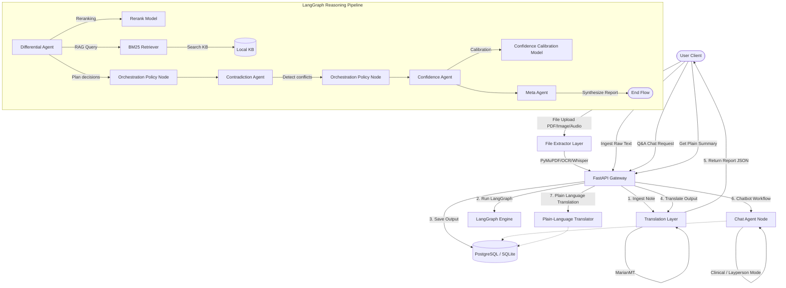
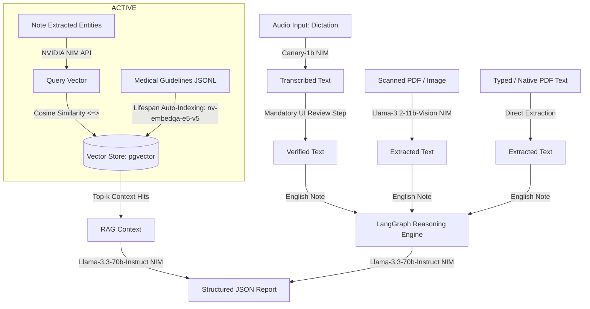

# Technical Requirements Document (TRD)
## Clinical Reasoning Engine

---

## 1. System Architecture Overview
The system is built on a decoupled Client-Server architecture:
- **Frontend**: A React web application compiled with Vite, using raw styling for maximum flexibility and performance.
- **Backend**: A FastAPI server orchestrating a multi-agent workflow using LangGraph, persisting clinical notes and reasoning traces via SQLAlchemy to a Neon PostgreSQL (production) or SQLite (local) database.
- **AI/ML & Ingestion Layer**: Consists of scispaCy for NER, MarianMT models for local translation, PyMuPDF and Tesseract OCR for PDF/Image document processing, external Whisper APIs for audio transcription, a local TF-IDF retriever for RAG, a trained linear reranker, a logistic regression confidence calibrator, and rate-limiting wrappers for external LLM microservices (Groq, NVIDIA NIM).



---

## 2. Core Modules & Component Breakdown

### 2.1. API Gateway (`backend/main.py`)
Exposes REST endpoints using FastAPI for ingesting notes (raw text or files), retrieving historical reasoning logs, interacting with the chatbot, obtaining simplified plain-language explanations, and reporting health checks.
- Endpoint: [main.py](file:///C:/Structured%20Clinical%20Reasoning%20Engine%20for%20Unstructured%20Discharge%20Notes/clinical-reasoning-engine/backend/main.py)
- Methods:
  - `POST /ingest`: Entry point for raw clinical note analysis. Resolves translation, triggers LangGraph, and persists output.
  - `POST /ingest-file`: Entry point for uploading files (PDF, PNG, JPG, MP3, WAV, etc.). Extracts text using PyMuPDF/OCR/Whisper and forwards it to the reasoning pipeline.
  - `POST /chat`: Exposes chatbot capabilities over the ingested note report context. Accepts clinical or layperson mode toggle.
  - `POST /explain/{note_id}`: Generates a plain-language summary and diagnosis breakdown of the ingested clinical report.
  - `GET /report/{note_id}`: Retrieves reasoning outputs. Supports dynamic translation if the requested display language differs from the stored language.
  - `GET /health`: Performs checkups on machine learning models, database connections, translation model cache, NIM and Groq settings, and environment variables.

### 2.2. Multilingual Edge Translation Layer (`backend/translation_layer.py`)
Handles target languages: German, French, Dutch, Spanish, and English.
- Script: [translation_layer.py](file:///C:/Structured%20Clinical%20Reasoning%20Engine%20for%20Unstructured%20Discharge%20Notes/clinical-reasoning-engine/backend/translation_layer.py)
- Components:
  - `detect_input_language`: Identifies language using `langdetect` or defaults to English.
  - `translate`: Performs tokenization and text translation using MarianMT (`Helsinki-NLP/opus-mt-{src}-{tgt}`). Chunks texts larger than 450 characters to fit the model's 512 context limit.
  - `build_display_report`: Recursively crawls the JSON payload and translates text fields (e.g., `text_span`, `sentence_text`, `description`, `rationale`) into the target language.

### 2.3. Clinical Timeline Ingestion (`backend/ingestion/`)
Responsible for document content extraction, section segmentation, and entity parsing.
- File Extractor: [file_extractor.py](file:///C:/Structured%20Clinical%20Reasoning%20Engine%20for%20Unstructured%20Discharge%20Notes/clinical-reasoning-engine/backend/ingestion/file_extractor.py). Detects content type and extracts text from:
  - Text Files (`.txt`): Raw UTF-8 decoding.
  - PDF Files (`.pdf`): Extracts native text using PyMuPDF. If native text is absent (scanned PDF), renders pages to images and runs Tesseract OCR fallback.
  - Image Files (`.png`, `.jpg`, `.jpeg`, etc.): Runs Tesseract OCR.
  - Audio Files (`.wav`, `.mp3`, etc.): Transcribes audio using API-based Groq Whisper (`whisper-large-v3`) or OpenAI Whisper (`whisper-1`) to avoid local model overhead.
- NER Extractor: [ner_extractor.py](file:///C:/Structured%20Clinical%20Reasoning%20Engine%20for%20Unstructured%20Discharge%20Notes/clinical-reasoning-engine/backend/ingestion/ner_extractor.py). Loads scispaCy (`en_core_sci_sm`) if available. Falls back to a deterministic regular-expression keyword-matching dictionary (`CLINICAL_PATTERNS`) to ensure local execution.
- Timeline Builder: [timeline_builder.py](file:///C:/Structured%20Clinical%20Reasoning%20Engine%20for%20Unstructured%20Discharge%20Notes/clinical-reasoning-engine/backend/ingestion/timeline_builder.py). Categorizes lines into Admission, Hospital Course, and Discharge. Infers event status (e.g., *worsening*, *new*, *resolved*, *improving*, *stable*, *active*) by looking for semantic cues in containing sentences.

### 2.4. Reasoning & Support Agents (`backend/agents/`)
Organized as discrete nodes in the LangGraph workflow and secondary support agents:
- **Differential Agent** ([differential.py](file:///C:/Structured%20Clinical%20Reasoning%20Engine%20for%20Unstructured%20Discharge%20Notes/clinical-reasoning-engine/backend/agents/differential.py)): Formulates differential hypotheses based on keywords matched in the timeline, querying a local RAG retriever, and ranking candidates.
- **Contradiction Agent** ([contradiction.py](file:///C:/Structured%20Clinical%20Reasoning%20Engine%20for%20Unstructured%20Discharge%20Notes/clinical-reasoning-engine/backend/agents/contradiction.py)): Scans the timeline sections to identify contradictions of types:
  - `missing_symptom`: Admission symptom not mentioned at discharge and lacking resolution notes.
  - `new_finding`: Symptom/diagnosis appearing at discharge without prior documentation.
  - `status_reversal`: Symptom marked as resolved in hospital course but active/worsened at discharge.
- **Confidence Agent** ([confidence.py](file:///C:/Structured%20Clinical%20Reasoning%20Engine%20for%20Unstructured%20Discharge%20Notes/clinical-reasoning-engine/backend/agents/confidence.py)): Extracts feature vectors for each diagnosis, runs perturbed probability passes to estimate variance/uncertainty, and outputs calibrated confidence percentages.
- **Meta Agent** ([meta.py](file:///C:/Structured%20Clinical%20Reasoning%20Engine%20for%20Unstructured%20Discharge%20Notes/clinical-reasoning-engine/backend/agents/meta.py)): Assembles the final structured `NoteReport` JSON payload and packages reasoning traces.
- **Chat Agent** ([chat_agent.py](file:///C:/Structured%20Clinical%20Reasoning%20Engine%20for%20Unstructured%20Discharge%20Notes/clinical-reasoning-engine/backend/agents/chat_agent.py)): Answers questions about the patient report in two modes:
  - `clinical`: Highly technical, precise vocabulary, tailored for clinicians.
  - `layperson`: Simplified everyday language, reassuring, using common analogies (e.g. electrical wiring for heart signals).
  - Enforces mandatory medical liability disclaimers at the beginning of all chat responses.
- **Plain-Language Translator** ([plain_lang_translator.py](file:///C:/Structured%20Clinical%20Reasoning%20Engine%20for%20Unstructured%20Discharge%20Notes/clinical-reasoning-engine/backend/agents/plain_lang_translator.py)): Translates the entire clinical reasoning output into a layperson summary (sections for simplified timeline, warning clarifications, and diagnosis analogies).

### 2.5. LangGraph Workflow Orchestration (`backend/agents/graph.py`)
Wires up the agents as a compiled state graph with middleman policy nodes:
- Script: [graph.py](file:///C:/Structured%20Clinical%20Reasoning%20Engine%20for%20Unstructured%20Discharge%20Notes/clinical-reasoning-engine/backend/agents/graph.py)
- Orchestration Nodes: [nodes.py](file:///C:/Structured%20Clinical%20Reasoning%20Engine%20for%20Unstructured%20Discharge%20Notes/clinical-reasoning-engine/backend/orchestration/nodes.py)
- Decisions ([policy.py](file:///C:/Structured%20Clinical%20Reasoning%20Engine%20for%20Unstructured%20Discharge%20Notes/clinical-reasoning-engine/backend/orchestration/policy.py)): 
  - `decide_post_differential`: Determines if there are enough candidate hypotheses to run learned rerank and evaluates contradiction risks.
  - `decide_post_contradiction`: Logs when weak ranking scores combined with high contradiction rates warrant additional clinical retrieval.

### 2.6. LLM Guardrails & Pacing Providers (`backend/*_guardrails.py`)
Provides deterministic pacing, thread-safe request queuing, and automatic backoff retries when calling external LLMs to avoid API rate limits:
- Groq Pacing: [groq_guardrails.py](file:///C:/Structured%20Clinical%20Reasoning%20Engine%20for%20Unstructured%20Discharge%20Notes/clinical-reasoning-engine/backend/groq_guardrails.py)
- NVIDIA NIM Pacing: [nim_guardrails.py](file:///C:/Structured%20Clinical%20Reasoning%20Engine%20for%20Unstructured%20Discharge%20Notes/clinical-reasoning-engine/backend/nim_guardrails.py)

---

## 3. LangGraph State Schema
The compiled workflow is represented by the `GraphState` TypedDict:
- State Definition: [graph.py](file:///C:/Structured%20Clinical%20Reasoning%20Engine%20for%20Unstructured%20Discharge%20Notes/clinical-reasoning-engine/backend/agents/graph.py#L21-L30)

```python
class GraphState(TypedDict, total=False):
    note_id: str                          # Unique identifier for the note
    note_text: str                        # Input English text of the clinical note
    timeline: ClinicalTimeline            # Extracted events grouped by section
    differentials: List[Hypothesis]       # List of candidate hypotheses
    contradictions: List[Contradiction]   # Identified contradictions
    confidence_scores: List[ConfidenceScore] # Calibrated probabilities
    reasoning_trace: List[AuditStep]      # Narrative steps taken by agents
    orchestration_trace: List[PolicyDecision] # Policy evaluations
    report: NoteReport                    # Final synthesized payload
```

---

## 4. Machine Learning & Statistical Layers

### 4.1. Learned Rerank Model (`backend/ml/ranking_model.py`)
Computes a ranking score over structural features to evaluate diagnosis relevance:
- Script: [ranking_model.py](file:///C:/Structured%20Clinical%20Reasoning%20Engine%20for%20Unstructured%20Discharge%20Notes/clinical-reasoning-engine/backend/ml/ranking_model.py)
- Features:
  - `base_score`: Event frequency matching score.
  - `retrieval_score`: Normalized BM25 search similarity.
  - `support_count`: Ratio of matches in the note (capped at 1.0).
  - `section_coverage`: Section density (Admission, Course, Discharge representation).
  - `discharge_support`: Weight of matches found explicitly in discharge plan.
  - `context_count`: Volume of retrieved contexts.
- Inference: Linear summation of weights:
  $$\text{Score} = \text{Bias} + \sum (\text{Feature}_i \times \text{Weight}_i)$$

### 4.2. Confidence Calibrator (`backend/ml/confidence_calibration.py`)
Applies logistic regression to map feature vectors to Brier-calibrated probabilities.
- Script: [confidence_calibration.py](file:///C:/Structured%20Clinical%20Reasoning%20Engine%20for%20Unstructured%20Discharge%20Notes/clinical-reasoning-engine/backend/ml/confidence_calibration.py)
- Features:
  - Reranker features + `rank_bonus` and `contradiction_penalty` (derived from the contradiction agent flags).
- Uncertainty & Variance: Runs 8 perturbed scoring iterations by jittering retrieval and base scores. Uncertainty is estimated as:
  $$\text{Uncertainty} = (\text{Variance} \times 18) + (\text{Contradiction Penalty} \times 0.15)$$
- Final Confidence:
  $$\text{Confidence} = \text{Average Calibrated Score} - (\text{Uncertainty} \times 0.18)$$

---

### 5. RAG Retrieval Layer (`backend/rag/retriever.py`)
Exposes a dual-mode retrieval architecture that adapts dynamically based on database configuration:
- Script: [retriever.py](file:///C:/Structured%20Clinical%20Reasoning%20Engine%20for%20Unstructured%20Discharge%20Notes/clinical-reasoning-engine/backend/rag/retriever.py)
- **PostgreSQL Mode (Production/Semantic)**:
  - Generates query embeddings at runtime via the NVIDIA NIM `/embeddings` endpoint (calling the `nvidia/nv-embedqa-e5-v5` model in [embeddings.py](file:///C:/Structured%20Clinical%20Reasoning%20Engine%20for%20Unstructured%20Discharge%20Notes/clinical-reasoning-engine/backend/rag/embeddings.py)).
  - Queries the PostgreSQL guidelines table using `pgvector` cosine distance (`<=>` operator) to fetch the top-k matches, solving term mismatch and lexical omissions (e.g. matching "SOB" to "dyspnea").
- **SQLite Mode (Local Development/Lexical Fallback)**:
  - Automatically falls back to a custom TF-IDF/BM25 token parser to score guideline overlap, maintaining the self-contained zero-dependency baseline.
  - Scoring Details: Calculates the inverse document frequency (IDF) for matching tokens and adds a keyword bonus (+0.3) for exact substring hits.

---

## 6. Future Upgrades: High-Fidelity Multi-NIM & pgvector Architecture [IMPLEMENTED pgvector]

The semantic retrieval layer and DB indexing configurations have been successfully integrated:



### 6.1. Component Upgrades & Seeding Strategy
1. **Semantic Embeddings & pgvector (Active)**:
   - **Lifespan Auto-Indexing**: Enabled in [index_guidelines.py](file:///C:/Structured%20Clinical%20Reasoning%20Engine%20for%20Unstructured%20Discharge%20Notes/clinical-reasoning-engine/backend/rag/index_guidelines.py). During server initialization, the application dynamically ensures the `vector` extension is enabled and builds/seeds the `clinical_guidelines` table.
   - **Online Similarity Lookup**: At query runtime, queries are encoded into 1024-dimensional vectors and evaluated against the database using raw SQL cast operators.
2. **Upcoming Vision-Language Model Ingestion (`meta/llama-3.2-11b-vision-instruct`)**:
   - Planned roadmap upgrade to replace the local Tesseract OCR engine for scanned PDFs.
3. **Upcoming Clinician Dictation Transcription (`Canary-1b`)**:
   - Planned transcription gate to review audio files.

### 6.2. Production Rate-Limiting & Dependency Warning
NVIDIA's free serverless endpoints are limited to development and prototyping. A production-grade release of this architecture requires transition to dedicated, self-hosted NIM containers deployed on private GPU clusters (using NGC Registry Docker setups) or paid enterprise endpoint keys to ensure low latency and high availability.

---

## 7. Document Links
- Product Context: [prd.md](file:///C:/Structured%20Clinical%20Reasoning%20Engine%20for%20Unstructured%20Discharge%20Notes/clinical-reasoning-engine/docs/prd.md)
- UI/UX Specifications: [ux_ui_design.md](file:///C:/Structured%20Clinical%20Reasoning%20Engine%20for%20Unstructured%20Discharge%20Notes/clinical-reasoning-engine/docs/ux_ui_design.md)
- Database Layout: [backend_schema.md](file:///C:/Structured%20Clinical%20Reasoning%20Engine%20for%20Unstructured%20Discharge%20Notes/clinical-reasoning-engine/docs/backend_schema.md)
- Implementation and Training Guide: [implementation_guide.md](file:///C:/Structured%20Clinical%20Reasoning%20Engine%20for%20Unstructured%20Discharge%20Notes/clinical-reasoning-engine/docs/implementation_guide.md)
